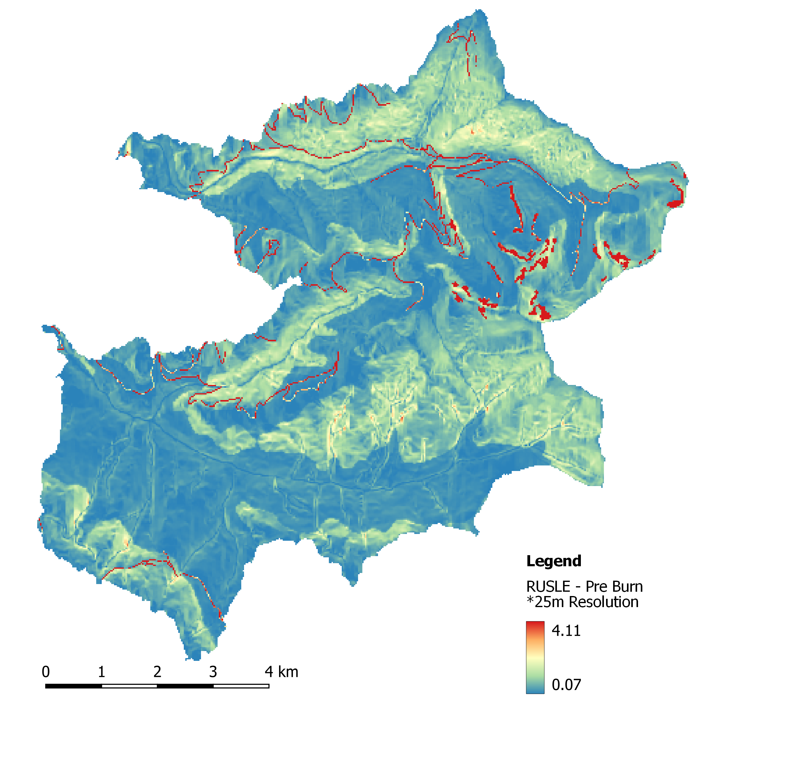
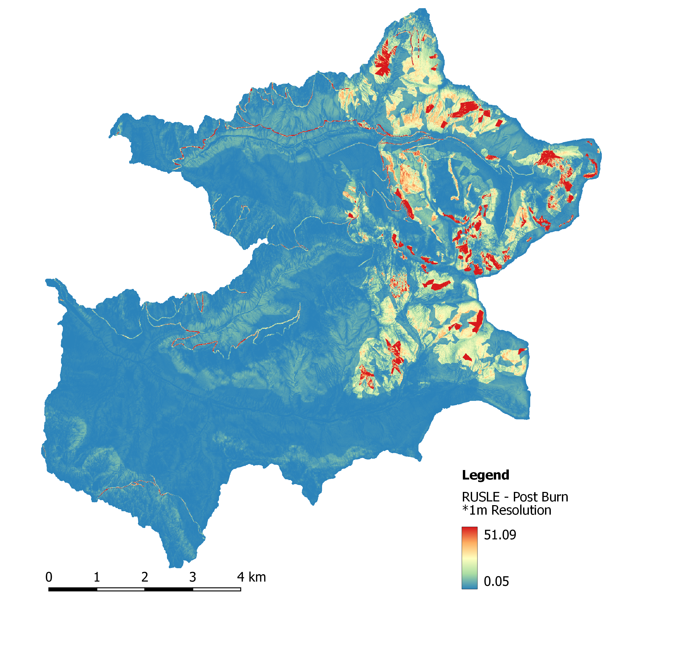
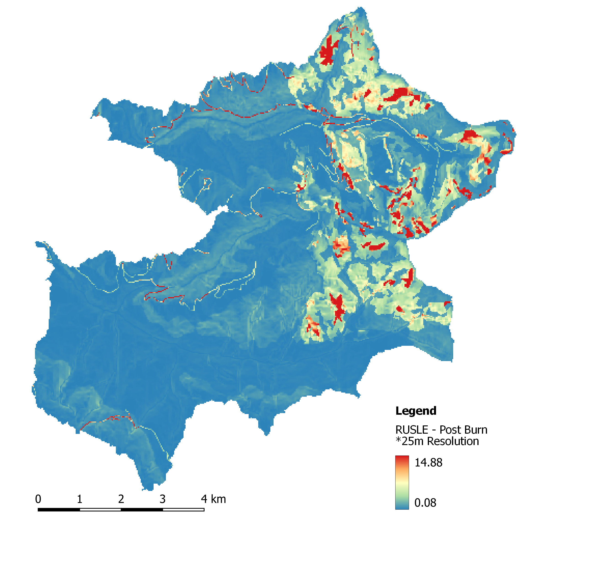

# Applying the RUSLE Equation: {#sec-applying-the-rusle-equation .unnumbered}

In this section, we show two example applications of the RUSLE. These case studies highlight applications of the RUSLE in the same region pre and post-fire.

## Application 1: RUSLE Post Burn {#sec-application-1-rusle-post-burn .unnumbered}

### Step 1: Load RUSLE Factors {#sec-step-1-load-rusle-factors .unnumbered}

``` r
K = raster("data/4/K/K_Factor.tif")
R = raster("data/4/R/R_Factor.tif")
LS = raster("data/4/LS/LS_Factor.tif")
C_PreBurn = raster("data/4/C/C_Factor_PreBurn.tif")
```

### Step 2: Re-sample RUSLE Factors {#sec-step-3-re-sample-rusle-factors .unnumbered}

``` r
K <-  resample(K, LS)
R <-  resample(R, LS)
C <-  resample(C, LS)
C_PreBurn <-  resample(C_PreBurn, LS)
```

### Step 3: Combine Factors using the RUSLE {#sec-step-4-combine-factors-using-the-rusle .unnumbered}

``` r
RUSLE_PreBurn <- LS*K*R*C_PreBurn
```




## Application 2: RUSLE Post Burn {#sec-application-2-rusle-post-burn .unnumbered}

### Step 1: Load RUSLE Factors {#sec-step-1-load-rusle-factors_post .unnumbered}

``` r
K = raster("data/4/K/K_Factor.tif")
R = raster("data/4/R/R_Factor.tif")
LS = raster("data/4/LS/LS_Factor.tif")
C_PostBurn = raster("data/4/C/C_Factor_PostBurn.tif")
```

### Step 2: Re-sample RUSLE Factors {#sec-step-3-resample-rusle-factors .unnumbered}

``` r
K <-  resample(K, LS)
R <-  resample(R, LS)
C <-  resample(C, LS)
C_PostBurn <-  resample(C_PostBurn, LS)
```

### Step 3: Combine Factors using the RUSLE {#sec-step-4-combine-factors-using-the-rusle-post .unnumbered}

``` r
RUSLE_PostBurn <- LS*K*R*C_PostBurn
```




